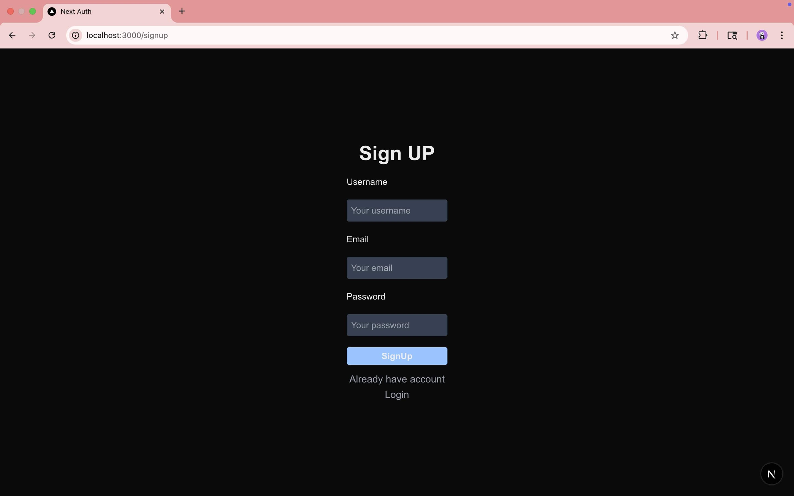
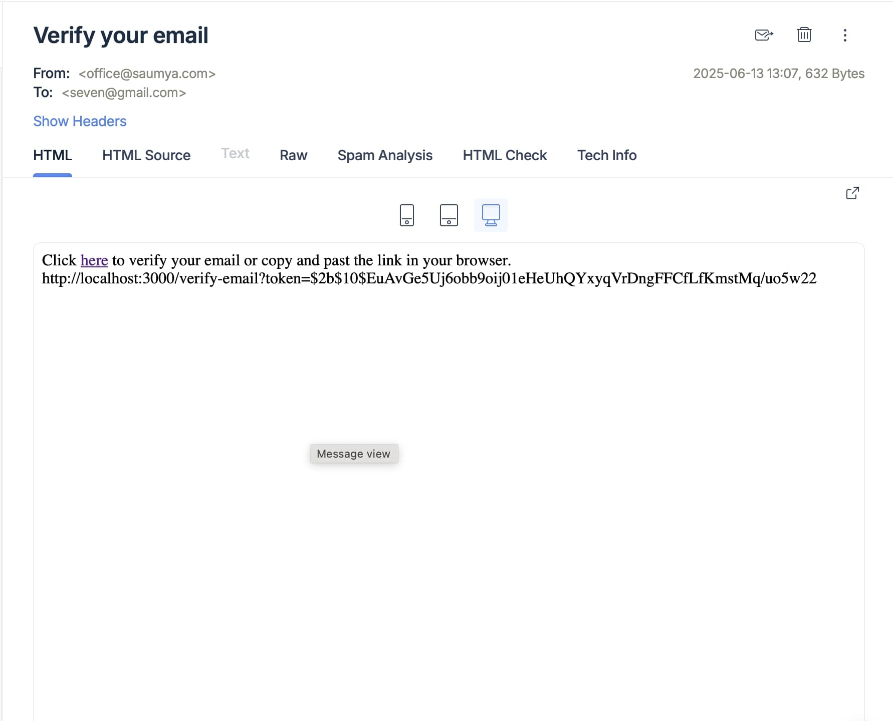
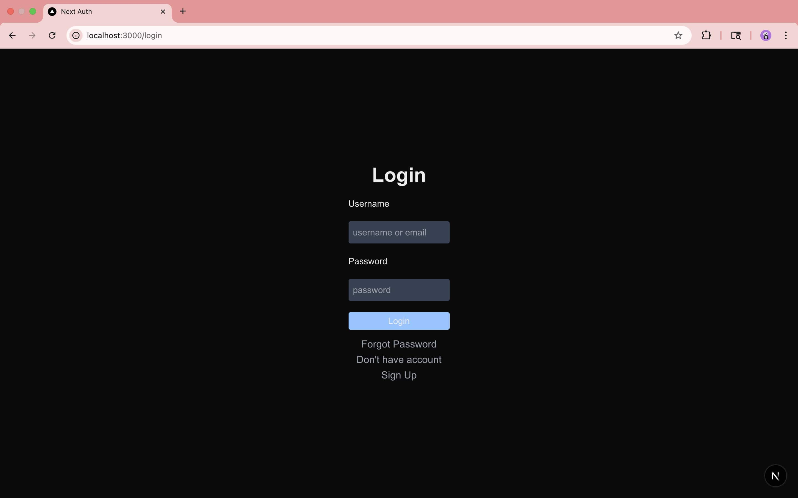
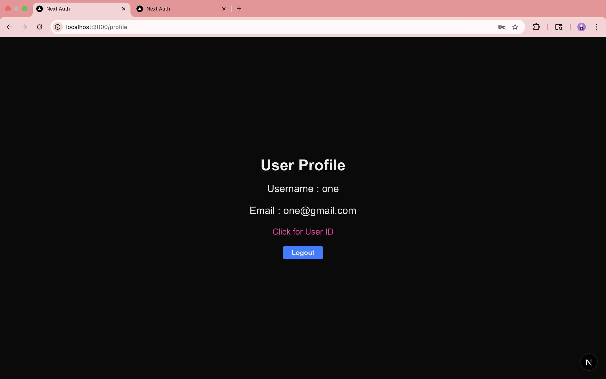
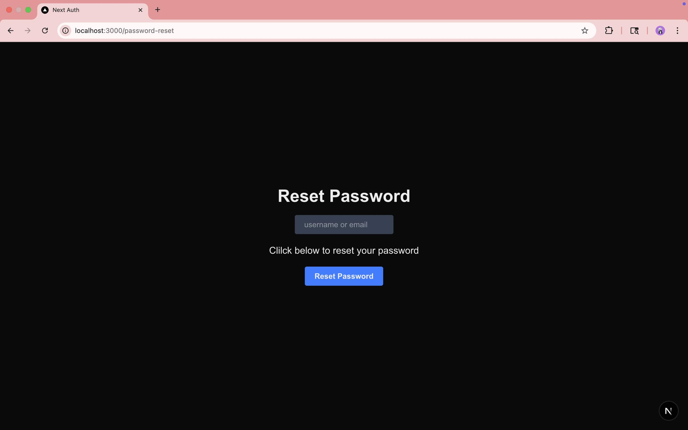
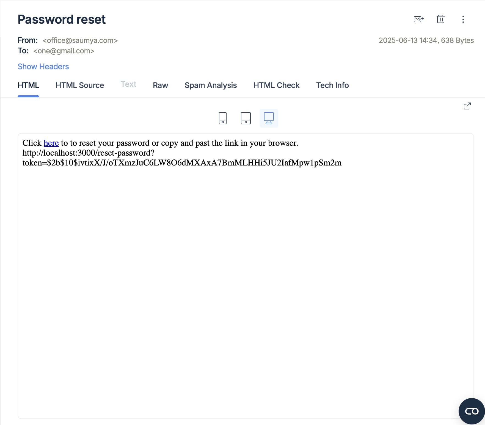
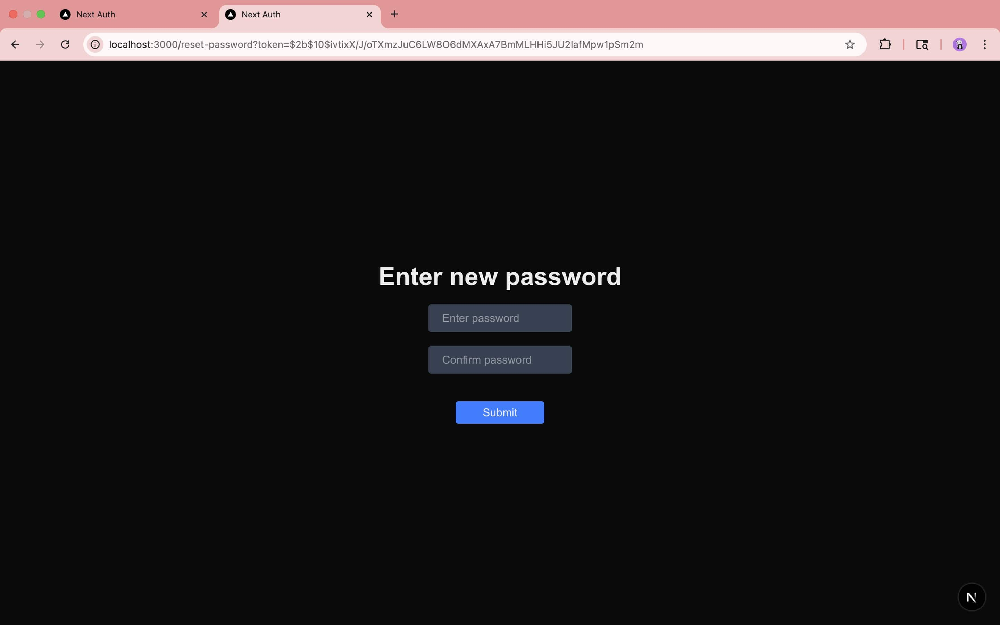

# 🔐 Authentication system - Build with Next.js

## Description

This is a Next.js project with primary focused on building user authentication services.

## ✨ Features

- Authentication
- Password reset
- Email verification

## 🛠️ Built With

- Next.js
- React.js
- Tailwind CSS
- MongoDB

## 📸 Screenshots

### Signup page



### Email verification page



### Login page



### Profile page



### Password reset request page



### Password reset email



### Password reset page



### [Video Demo](https://youtu.be/ad75tToNwUk)

[](https://youtu.be/ad75tToNwUk)

## Getting Started

First, run the development server:

```bash
npm run dev
# or
yarn dev
# or
pnpm dev
# or
bun dev
```

Open [http://localhost:3000](http://localhost:3000) with your browser to see the result.

You can start editing the page by modifying `app/page.tsx`. The page auto-updates as you edit the file.

This project uses [`next/font`](https://nextjs.org/docs/app/building-your-application/optimizing/fonts) to automatically optimize and load [Geist](https://vercel.com/font), a new font family for Vercel.

## 🙋‍♂️ Author

- Saumya Nayak – [@saumyarex](https://github.com/saumyarex)
